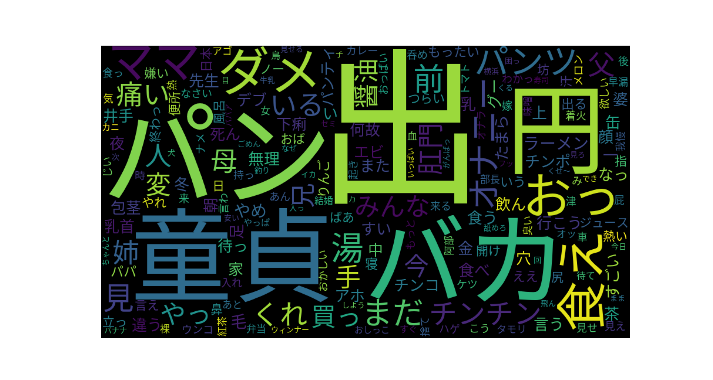
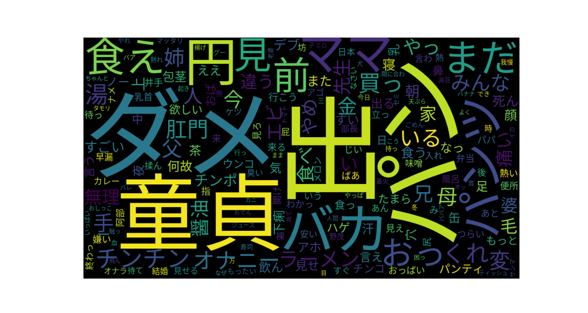

# Soramimi Word Cloud

"Soramimi Hour" is an well-know feature on the Japanese TV show,
[Tamori Club](https://www.tv-asahi.co.jp/tamoriclub/#/?category=variety).

This repository contains an scraping script for obtaining almost all
soramimi works introduced on the program and the visualization script.
The data source is
[A list of past soramimi featured on "Soramimi Hour"](http://www7a.biglobe.ne.jp/~soramimiupdate/past.htm).

## Visualizing soramimi with word cloud

On "Soramimi Hour", Tamori scores every soramimi by selecting a prize from
towel, earpick, T-shirt, and jacket. The visualization script can generate
a word cloud weighted by the evaluation.
The weight setting is like this:

| Prize   | Weight |
| ------- | ------ |
| Towel   | 1.0    |
| Earpick | 1.5    |
| T-shirt | 2.0    |
| Jacket  | 2.5    |
| Else    | 1.0    |

